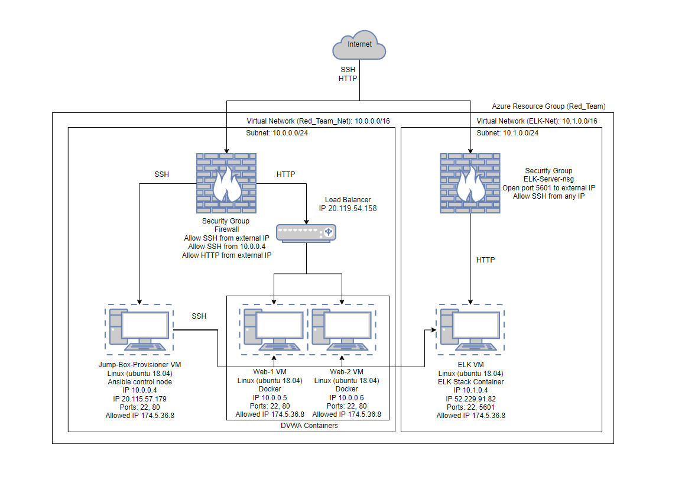
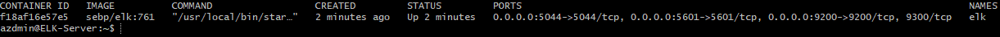

## Automated ELK Stack Deployment

The files in this repository were used to configure the network depicted below.

These files have been tested and used to generate a live ELK deployment on Azure. They can be used to either recreate the entire deployment pictured above. Alternatively, select portions of the playbook file may be used to install only certain pieces of it, such as Filebeat.

  - [install-elk.yml](Ansible/install-elk.yml)

This document contains the following details:
- Description of the Topology
- Access Policies
- ELK Configuration
  - Beats in Use
  - Machines Being Monitored
- How to Use the Ansible Build

### Description of the Topology

The main purpose of this network is to expose a load-balanced and monitored instance of DVWA, the D*mn Vulnerable Web Application.

Load balancing ensures that the application will be highly available, in addition to restricting access to the network.
- Load balancers protect the availability aspect of security. The advantage of a jump box is that it allows a user to access and manage multiple devices from a single node.

Integrating an ELK server allows users to easily monitor the vulnerable VMs for changes to the operating systems and system services.
- Filebeat is used to monitor log files, collect log events, and sends them to Logstash and Elasticsearch. 
- Metricbeat collects metrics from an operating system as well as its services, and send those to Logstash and Elasticsearch.

The configuration details of each machine may be found below.

| Name     | Function | IP Address | Operating System |
|----------|----------|------------|------------------|
| Jump Box | Gateway  | 10.0.0.4   | Linux            |
| WEB-1    | Server   | 10.0.0.5   | Linux            |
| WEB-2    | Server   | 10.0.0.6   | Linux            |
| ELK      | Server   | 10.1.0.4   | Linux            |

### Access Policies

The machines on the internal network are not exposed to the public Internet. 

Only the Elk machine can accept connections from the Internet. Access to this machine is only allowed from the following IP addresses:
- Home Public IP via port 5601.

Machines within the network can only be accessed by Jump-Box-Provisioner.
- Allowed access to the ELK VM from Jump-Box-Provisioner with IP 10.0.0.4.

A summary of the access policies in place can be found in the table below.

| Name     | Publicly Accessible | Allowed IP Addresses |
|----------|---------------------|----------------------|
| Jump Box | Yes                 | Home Public IP       |
|  Web-1   | No                  | 10.0.0.4             |
|  Web-2   | No                  | 10.0.0.4             |
|  ELK     | No                  | 10.0.0.4 / Home IP   |

### Elk Configuration

Ansible was used to automate configuration of the ELK machine. No configuration was performed manually, which is advantageous because...
- A single Ansible playbook can be ran on multiple servers quicly and with ease.

The playbook implements the following tasks:
- Install Docker
- Install pip3
- Install Docker python module
- Download and launch docker web container "elk"
- Enable docker service on boot

The following screenshot displays the result of running `docker ps` after successfully configuring the ELK instance.

### Target Machines & Beats
This ELK server is configured to monitor the following machines:
- Web-1: 10.0.0.5
- Web-2: 10.0.0.6

We have installed the following Beats on these machines:
- Filebeat 
- Metricbeat

These Beats allow us to collect the following information from each machine:
- Filebeat collects log files and events. For example, Filebeat can collect log files generated by Apache.
- Metricbeat collects metric and operating system statistics. For example, we can see CPU usage.

### Using the Playbook
In order to use the playbook, you will need to have an Ansible control node already configured. Assuming you have such a control node provisioned: 

SSH into the control node and follow the steps below:
- Copy the [install-elk.yml](Ansible/install-elk.yml) file to /etc/ansible.
- Update the /etc/ansible/hosts file to include `10.1.0.4 ansible_python_interpreter=/usr/bin/python3`.
- Run the playbook, and navigate to http://ELK-EXTERNAL-IP:5601/app/kibana to check that the installation worked as expected.
